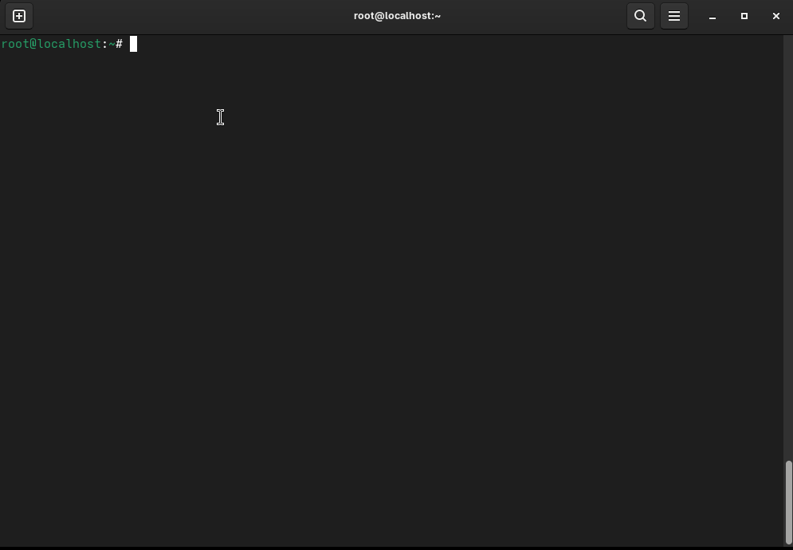
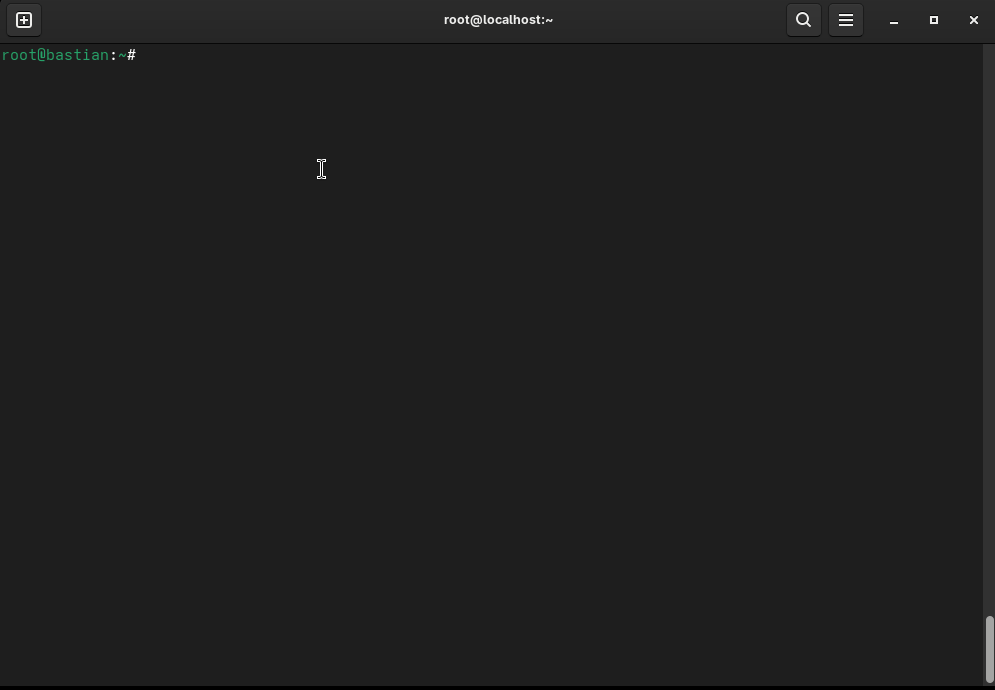
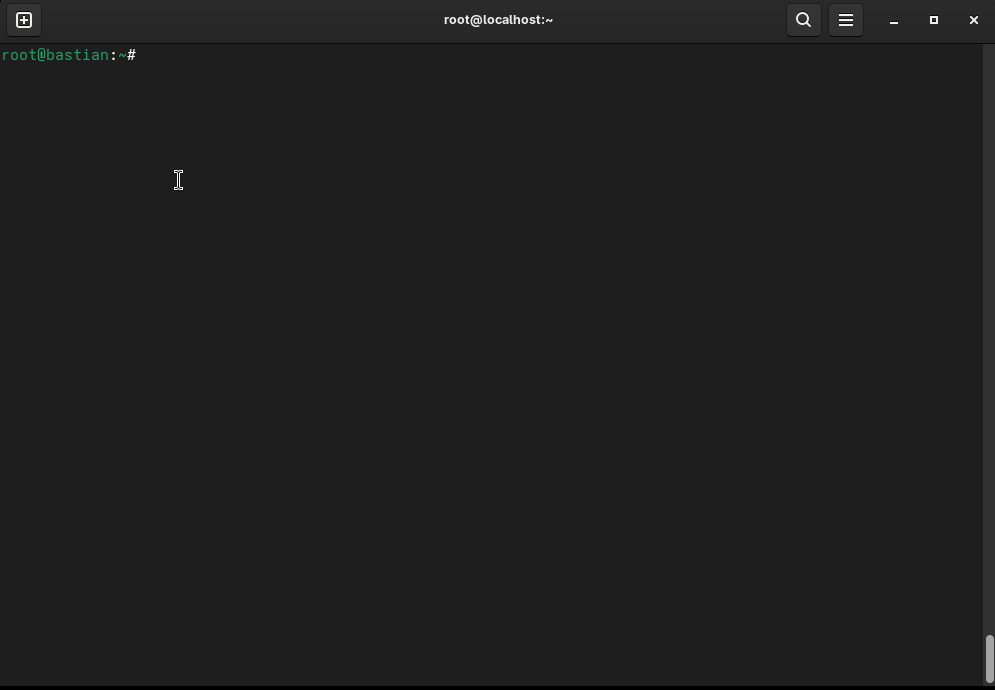
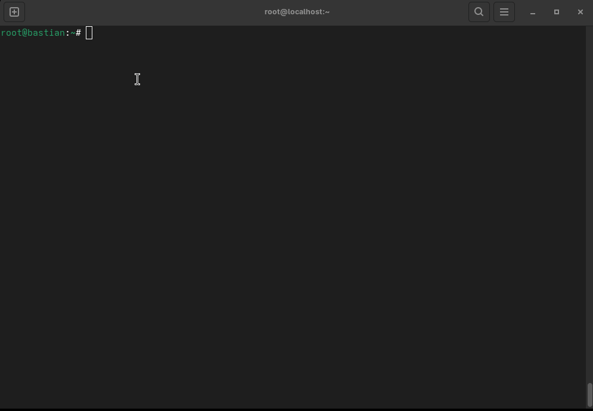
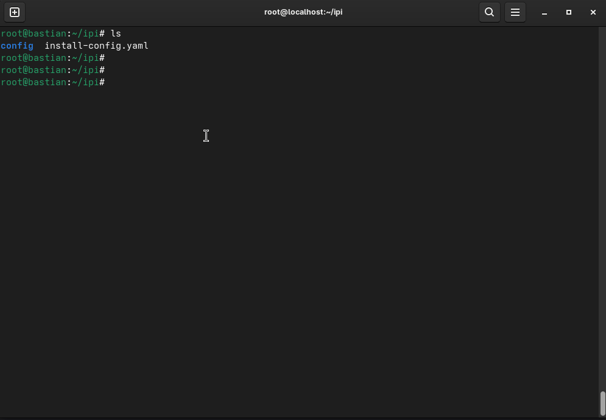

# 🚀 OpenShift IPI Cluster Deployment on vSphere

This guide provides a complete walkthrough to deploy an **OpenShift Container Platform (OCP)** IPI (Installer-Provisioned Infrastructure) cluster on **VMware vSphere**.

---

## 🧰 Prerequisites

### vSphere Requirements

* vCenter 6.7 or newer
* ESXi hosts with shared storage and configured networking
* Forward and reverse DNS entries for:

  * `api`, `api-int`, and wildcard `*.apps`
* DHCP server to dynamically assign IPs
* Properly synchronized NTP
* vSphere credentials with VM, disk, and network permissions

### IP Addressing, hostname, and DNS Setup
```bash
hostnamectl set-hostname bastian.ipicluster.tayabtahir.com
exec bash
```
Verify ip address and resolve.conf file.
```bash
ip -br -c a
cat /etc/resolve.conf
```



Install and configure `dnsmasq` for DNS and DHCP:

```bash
dnf install dnsmasq -y
```

Create `/etc/dnsmasq.conf`:

```ini
domain-needed
bogus-priv
server=8.8.8.8
server=8.8.4.4
listen-address=192.168.12.10
no-poll
addn-hosts=/etc/dnshost
domain=ipicluster.tayyabtahir.com
resolv-file=/etc/resolv.conf
address=/.apps.ipicluster.tayyabtahir.com/192.168.12.28

# DHCP Configuration
dhcp-range=ens33,192.168.12.2,192.168.12.30,255.255.255.0,4m
dhcp-option=option:router,192.168.12.1
interface=ens33
```

Create `/etc/dnshost`:

```ini
192.168.12.29 api.ipicluster.tayyabtahir.com api
192.168.12.29 api-int.ipicluster.tayyabtahir.com api-int
```

Restart the service:

```bash
systemctl restart dnsmasq
```



Set the bastion host's DNS to its own IP:

```bash
nmcli connection modify ens33 ipv4.dns 192.168.12.10
nmcli connection down ens33 && nmcli connection up ens33
cat /etc/resolv.conf
```


---

## ⚙️ OpenShift Client Tools

### Step 1: Download and Install Tools

* [OpenShift Installer](https://console.redhat.com/openshift/install/vsphere/installer-provisioned)
* [Pull Secret](https://console.redhat.com/openshift/install/vsphere/installer-provisioned)

```bash
wget https://mirror.openshift.com/pub/openshift-v4/x86_64/clients/ocp/stable/openshift-install-linux.tar.gz
wget https://mirror.openshift.com/pub/openshift-v4/x86_64/clients/ocp/stable/openshift-client-linux.tar.gz

tar -zxvf openshift-install-linux.tar.gz
tar -zxvf openshift-client-linux.tar.gz

cp oc kubectl /usr/local/bin/
cp openshift-install /usr/local/bin/

openshift-install version
oc version
```



---

## 📁 Directory Structure

```bash
mkdir -p ~/ipi/config
cd ~/ipi
```

---

## 🗂️ Step 2: Generate `install-config.yaml`

Run the installer:

```bash
openshift-install create install-config --dir=config
```

You will be prompted for:

* Platform: **vSphere**
* vCenter hostname/IP
* vCenter credentials
* Datacenter & Cluster
* Default datastore & network
* Base domain (e.g., `tayyabtahir.com`)
* Cluster name (e.g., `ipicluster`)
* Pull secret

> **Edit `install-config.yaml` to update the CIDR block:**

Replace:

```yaml
machineNetwork:
  - cidr: 10.0.0.0/16
```

With:

```yaml
machineNetwork:
  - cidr: 192.168.12.0/24
```


https://github.com/user-attachments/assets/d921f950-e9c1-4d52-8d34-c69d08f14bbe


---

## 🏗️ Step 3: Deploy the Cluster

```bash
openshift-install create cluster --dir=config
```

This will:

* Deploy a bootstrap VM
* Launch control plane & worker VMs
* Approve CSRs automatically
* Complete installation

> 🕒 Takes \~30–60 minutes based on your resources.


https://github.com/user-attachments/assets/1293df36-2d81-49b0-9929-9c383001e6a7

You can verify from vSphere that VMs have been created there.


---

## 🔎 Step 4: Verify the Cluster

Once complete, export the kubeconfig:

```bash
export KUBECONFIG=config/auth/kubeconfig
```

Check cluster status:

```bash
oc get nodes
oc get co  # View cluster operators
```



---

## 🌐 Web Console Access

Access the OpenShift console:

```
https://console-openshift-console.apps.ipicluster.tayyabtahir.com
```

Login using:

```bash
cat config/auth/kubeadmin-password
```

---

## 🧹 Cleanup

To destroy the cluster:

```bash
openshift-install destroy cluster --dir=config
```

---

## 📌 Notes

* Create a folder in vSphere to organize master and worker VMs.
* Ensure your DHCP IP range doesn't overlap with static IPs defined in DNS.
* Always verify DNS resolution and DHCP lease assignments before starting the install.

---

Happy Hacking! 💻☁️
